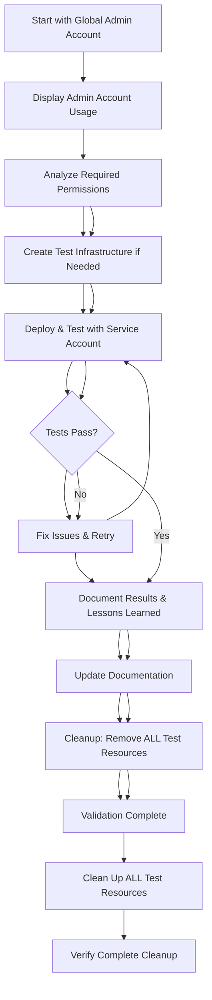
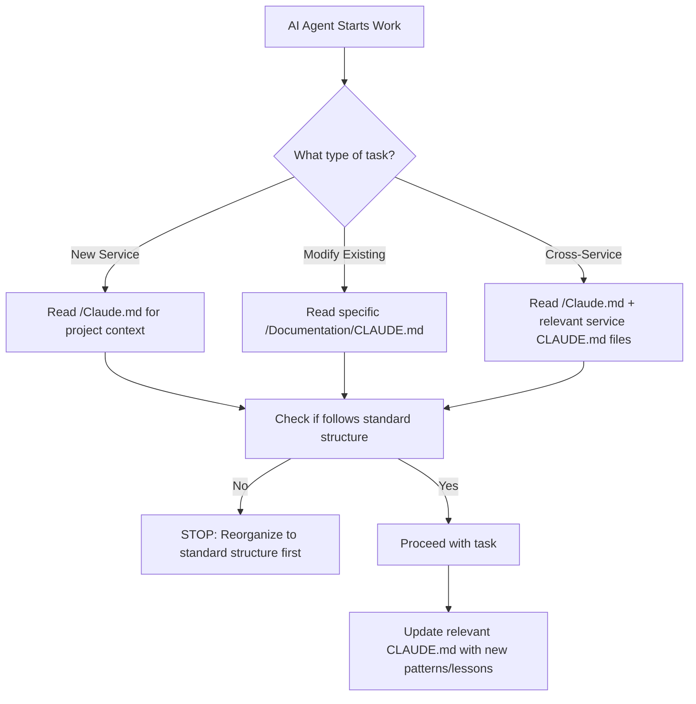

# AI Agent Guide - Azure Enterprise Security Automation Suite

## 🎯 CRITICAL: Read This First

**This document is MANDATORY reading for all AI agents working on this project. It contains essential guardrails, organization standards, and lessons learned to prevent project convolution and maintain enterprise-grade quality.**

---

## 📋 Quick Start Checklist

**BEFORE starting ANY work:**
```markdown
□ Read this entire document
□ Read project /Claude.md for overall context
□ Read service-specific /Documentation/CLAUDE.md (if working on existing service)
□ Verify service follows standard directory structure
□ Check /LESSONS-LEARNED.md for known pitfalls
□ Confirm which deployment scripts are CURRENT (no -Enhanced/-Fixed suffixes)
□ Validate PowerShell 7+ compatibility requirements
□ Review Microsoft Graph permissions against official documentation
□ Authenticate with provided Global Admin test account
□ Review Testing & Validation Workflow section below
```

---

## 🏗️ Project Overview

### Mission Statement
Transform enterprise Azure security management through comprehensive automation that proactively identifies, monitors, and remediates security risks while maintaining compliance and operational excellence.

### Core Services Architecture
```
Azure Enterprise Security Automation Suite
├── Identity & Device Security
│   ├── Device Cleanup Automation
│   └── MFA Compliance Monitor
├── Application Security  
│   ├── Application Permission Auditor
│   ├── Service Principal Credential Manager
│   ├── Enterprise App Usage Monitor
│   └── Enterprise App Certificate Monitor
└── Infrastructure Security
    └── Azure Files Secure Deployment
```

### Security Principles
1. **Zero Trust Architecture**: Never trust, always verify
2. **Least Privilege Access**: Minimal required permissions only
3. **Defense in Depth**: Multiple layers of security controls
4. **Comprehensive Audit Trails**: Complete logging for compliance
5. **Fail-Fast Security**: Immediate termination on security violations

---

## 🧪 MANDATORY: Testing & Validation Workflow

### Overview
All AI agents MUST follow this comprehensive testing workflow that ensures security through least-privilege validation and maintains a clean test environment.

### Authentication Accounts
- **Global Admin Account**: Provided for test tenant access (high-privilege operations only)
- **Test Service Accounts**: AI agent creates these with minimal required permissions
- **Test Tenant**: Dedicated environment for validation and testing

### 🔒 Secure Credential Management
**CRITICAL: Never use hard-coded credentials in scripts or commit them to repositories.**

**Approved Methods for AI Agents:**
1. **Environment Variables** (Preferred for testing):
   ```powershell
   $TenantId = $env:AZURE_TEST_TENANT_ID
   $ClientId = $env:AZURE_TEST_CLIENT_ID
   $ClientSecret = $env:AZURE_TEST_CLIENT_SECRET
   $SubscriptionId = $env:AZURE_TEST_SUBSCRIPTION_ID
   $ResourceGroup = $env:AZURE_TEST_RESOURCE_GROUP
   ```

2. **Azure Key Vault** (Production):
   ```powershell
   $Secret = Get-AzKeyVaultSecret -VaultName "test-keyvault" -Name "test-client-secret"
   ```

3. **Secure Interactive Prompt** (Development):
   ```powershell
   $Credential = Get-Credential -Message "Enter test service principal credentials"
   ```

**Test Environment Configuration:**
- **Test Tenant ID**: Use environment variable `AZURE_TEST_TENANT_ID`
- **Test Subscription ID**: Use environment variable `AZURE_TEST_SUBSCRIPTION_ID`  
- **Test Resource Group**: Use environment variable `AZURE_TEST_RESOURCE_GROUP`
- **Service Principal**: Created dynamically during testing, not pre-existing

### 🔐 Account Usage Transparency (MANDATORY)

**ALWAYS clearly display which account is being used for each operation:**

```powershell
Write-Host "🔐 ACCOUNT IN USE:" -ForegroundColor Cyan
Write-Host "==================" -ForegroundColor Cyan
Write-Host "Account: $AccountName" -ForegroundColor White
Write-Host "Client ID: $ClientId" -ForegroundColor White
Write-Host "Purpose: $Purpose" -ForegroundColor White
Write-Host "Permissions: $PermissionsList" -ForegroundColor Gray
Write-Host "Auth Type: $AuthType" -ForegroundColor Gray
Write-Host "==================" -ForegroundColor Cyan
```

**Example Output Format:**
```
🔐 ACCOUNT IN USE:
==================
Account: AppPermissionAuditor-Test-20250819194448
Client ID: 19df5adf-4f99-4221-9323-e4d5296aa75b
Purpose: Running Application Permission Auditor with least privileges
Permissions: Application.Read.All, Directory.Read.All, DelegatedPermissionGrant.Read.All
Auth Type: Service Principal (App-Only)
==================
```

**Required for Each Phase:**
1. **Creation Phase**: "Using Global Admin account to CREATE test resources"
2. **Execution Phase**: "Using newly provisioned test account to RUN the script"
3. **Cleanup Phase**: "Using Global Admin account to REMOVE test resources"

### Complete Testing Workflow



### Phase 1: Global Admin Setup & Analysis
**Using Global Admin Account (provided securely via environment variables):**
```powershell
# 1. Connect with Global Admin credentials (provided by user)
# SECURITY: Use environment variables, never hard-code credentials
$TenantId = $env:AZURE_TEST_TENANT_ID
$ClientId = $env:AZURE_TEST_CLIENT_ID
$ClientSecret = $env:AZURE_TEST_CLIENT_SECRET
$SubscriptionId = $env:AZURE_TEST_SUBSCRIPTION_ID
$ResourceGroup = $env:AZURE_TEST_RESOURCE_GROUP

# Convert secret to secure string
$SecureSecret = ConvertTo-SecureString $ClientSecret -AsPlainText -Force
$Credential = New-Object System.Management.Automation.PSCredential($ClientId, $SecureSecret)

# Connect to Azure and Microsoft Graph
Connect-AzAccount -ServicePrincipal -Credential $Credential -TenantId $TenantId -SubscriptionId $SubscriptionId
Connect-MgGraph -ClientSecretCredential $Credential -TenantId $TenantId

# 2. Analyze script/automation requirements
# - Identify all Azure resources needed
# - List all Microsoft Graph permissions required
# - Document any special configurations needed
```

### Phase 2: Least-Privilege Test Account Creation
**Create service account with ONLY required permissions:**
```powershell
# 1. Create test service principal with descriptive name
$TestSPName = "TestSP-[ServiceName]-[Timestamp]"
$TestSP = New-MgApplication -DisplayName $TestSPName

# 2. Grant ONLY the minimum permissions identified in Phase 1
# Example for Device Cleanup:
$RequiredPermissions = @(
    "Device.ReadWrite.All",
    "User.Read.All", 
    "Directory.ReadWrite.All"
)

foreach ($Permission in $RequiredPermissions) {
    # Grant each permission individually and document why it's needed
}

# 3. Create service principal secret/certificate
$TestSecret = Add-MgApplicationPassword -ApplicationId $TestSP.Id

# 4. Document the test account details for later cleanup
$TestAccountInfo = @{
    ApplicationId = $TestSP.Id
    DisplayName = $TestSPName
    CreatedDate = Get-Date
    RequiredPermissions = $RequiredPermissions
}
```

### Phase 3: Test Infrastructure Provisioning
**Create any required Azure resources:**
```powershell
# Only if script requires Azure resources (like Automation Account, Storage)
# Use naming convention: "test-[service]-[timestamp]"

# Example for Automation Account testing:
$TestResourceGroup = "rg-test-devicecleanup-$(Get-Date -Format 'yyyyMMddHHmm')"
$TestAutomationAccount = "aa-test-devicecleanup-$(Get-Date -Format 'yyyyMMddHHmm')"

# Create with Global Admin, document for cleanup
New-AzResourceGroup -Name $TestResourceGroup -Location "East US"
New-AzAutomationAccount -ResourceGroupName $TestResourceGroup -Name $TestAutomationAccount
```

### Phase 4: Least-Privilege Testing
**Switch to test service account and validate:**
```powershell
# 1. Disconnect Global Admin
Disconnect-AzAccount
Disconnect-MgGraph

# 2. Connect with test service principal
$SecureSecret = ConvertTo-SecureString $TestSecret.SecretText -AsPlainText -Force
$Credential = New-Object System.Management.Automation.PSCredential($TestSP.AppId, $SecureSecret)
Connect-AzAccount -ServicePrincipal -Credential $Credential -TenantId $TestTenantId
Connect-MgGraph -ClientSecretCredential $Credential -TenantId $TestTenantId

# 3. Test ALL script functionality with limited permissions
# - Run in WhatIf mode first
# - Test error handling with insufficient permissions
# - Validate all expected operations work
# - Document any permission gaps discovered

# 4. Validate security controls
# - Confirm script fails gracefully with insufficient permissions
# - Test input validation and error handling
# - Verify audit logging works correctly
```

### Phase 5: Documentation & Lessons Learned
**Document everything discovered during testing:**
```markdown
## Testing Results for [Service Name]

### Test Environment
- Test Tenant: [ID]
- Test Service Principal: [Name and ID]
- Test Duration: [Start] - [End]
- Global Admin Account: [Used for provisioning only]

### Permissions Validation
- Required Permissions: [List with justification for each]
- Permission Gaps Found: [Any issues discovered]
- Security Controls Validated: [What was tested]

### Infrastructure Requirements
- Azure Resources Created: [List with purposes]
- Configuration Requirements: [Any special setup needed]
- Dependencies: [External requirements]

### Issues Discovered
- [List any problems found and how they were resolved]
- [Document any Azure-specific timing issues]
- [Note any PowerShell compatibility concerns]

### Recommendations
- [Suggest any improvements to the script]
- [Document any additional safety controls needed]
- [Recommend any documentation updates]
```

### Phase 6: Complete Cleanup
**MANDATORY: Remove ALL test resources using Global Admin:**
```powershell
# 1. Reconnect with Global Admin
Connect-AzAccount -TenantId $TestTenantId  
Connect-MgGraph -TenantId $TestTenantId -Scopes "Directory.ReadWrite.All"

# 2. Remove test service principal and app registration
Remove-MgApplication -ApplicationId $TestAccountInfo.ApplicationId

# 3. Remove test Azure resources (if any were created)
Remove-AzResourceGroup -Name $TestResourceGroup -Force

# 4. Remove any test data or configurations
# - Clean up any test users created
# - Remove test groups or role assignments
# - Clear any test data from storage accounts

# 5. Verify cleanup completion
# - List remaining resources to ensure nothing was missed
# - Document cleanup completion with timestamp
```

### Validation Checklist
**Before considering testing complete:**
```markdown
□ Test service account created with minimal required permissions
□ All script functionality tested with least-privilege account
□ Error handling validated with insufficient permissions
□ Security controls verified (input validation, audit logging)
□ All test resources documented for cleanup
□ Issues and lessons learned documented
□ README and CLAUDE.md files updated with findings
□ Test service principal completely removed
□ All test Azure resources completely removed
□ Test data and configurations cleaned up
□ Cleanup completion verified and documented
```

### Security Requirements
1. **Never commit test credentials** to any repository
2. **Always use environment variables** for credential storage during testing
3. **Rotate exposed credentials immediately** if accidentally committed or shared
4. **Always use WhatIf mode** for initial testing
5. **Test permission boundaries** - verify script fails appropriately with insufficient access
6. **Document security controls** - input validation, error handling, audit logging
7. **Complete cleanup is mandatory** - no test resources should remain in the tenant

### 🚨 CRITICAL Security Note
**If Global Admin credentials are provided:**
- Store them as environment variables immediately: `$env:AZURE_TEST_TENANT_ID = 'your-tenant-id'`
- Never include them in code, scripts, or documentation
- If credentials are accidentally exposed, rotate them immediately
- Use the provided test resource group for all testing resources

### Emergency Cleanup
**If testing is interrupted:**
```powershell
# Search for and remove any test resources that may have been left behind
Get-MgApplication -Filter "startswith(displayName, 'TestSP-')"
Get-AzResourceGroup | Where-Object {$_.ResourceGroupName -like "rg-test-*"}
```

---

## 📁 MANDATORY: Standardized Service Architecture

**ALL services MUST follow this exact structure:**

```
[Service-Name]/
├── README.md                    # PRIMARY user documentation
├── CHANGELOG.md                 # Version history and updates
├── Scripts/
│   ├── [MainScript].ps1        # Primary automation script
│   └── [SupportScripts].ps1    # Helper functions ONLY
├── Azure-Automation/
│   ├── Deploy-[Service].ps1    # CURRENT deployment script
│   ├── Create-[Service]DeploymentGroup.ps1
│   ├── Grant-[Service]Permissions.ps1
│   └── README.md               # Deployment-specific instructions
├── Tests/
│   ├── Unit/                   # Function-level tests
│   ├── Integration/            # Workflow tests
│   └── Test-[Service]Connection.ps1
├── Documentation/
│   ├── CLAUDE.md              # AI agent instructions ONLY
│   ├── ARCHITECTURE.md        # Technical design decisions
│   └── TROUBLESHOOTING.md     # Known issues and solutions
├── Examples/                  # Usage examples (if needed)
└── Reports/                   # Output directory (gitignored)
```

**⚠️ CRITICAL: If a service doesn't follow this structure, STOP and reorganize it first before making any changes.**

---

## 🚨 Critical Anti-Patterns - NEVER DO THESE

### ❌ File Organization Anti-Patterns
- **Creating multiple versions of scripts with suffixes** (Deploy-Service-Enhanced.ps1, Deploy-Service-Fixed.ps1)
- **Mixing manual scripts with automation scripts** in same directory
- **Placing deployment scripts in multiple locations**
- **Creating README files at every directory level**
- **Using "Manual-" prefix** in script names

### ❌ Documentation Anti-Patterns
- **Duplicating same information across multiple files**
- **Putting user documentation in CLAUDE.md files**
- **Writing AI instructions in README files**
- **Creating service documentation without updating main project docs**

### ❌ Development Anti-Patterns
- **Assuming PowerShell cmdlets exist without validation**
- **Hardcoding Azure resource names/IDs**
- **Using deprecated Azure PowerShell modules**
- **Implementing permissions without checking Microsoft documentation first**
- **Creating cross-service dependencies in automation logic**

---

## 🤖 AI Agent Decision Trees

### Decision Tree 1: Task Type Assessment



### Decision Tree 2: New vs. Existing Service

```
Is this a NEW automation service?
├── YES → Follow standard service template exactly
│   ├── Create all mandatory directories
│   ├── Use standard naming conventions
│   ├── Include all required documentation files
│   └── Add to main /README.md service list
│
└── NO → Working with existing service
    ├── Does service follow standard structure?
    │   ├── NO → STOP: Reorganize first, then implement changes
    │   └── YES → Proceed with modifications
    │
    └── Are you modifying deployment scripts?
        ├── YES → Update CURRENT script only (no -Enhanced/-Fixed versions)
        └── NO → Update main automation script
```

---

## 📝 File Naming Conventions

### ✅ Correct Naming Patterns

**Deployment Scripts:**
- `Deploy-[ServiceName].ps1` (CURRENT VERSION)
- `Create-[Service]DeploymentGroup.ps1`
- `Grant-[Service]Permissions.ps1`
- `Validate-[Service]Deployment.ps1`

**Main Scripts:**
- `[ServiceName].ps1` (e.g., `DeviceCleanupAutomation.ps1`)

**Test Scripts:**
- `Test-[Service]Connection.ps1`
- `Test-[Specific-Function].ps1`

### ❌ Deprecated Patterns (Delete These)
- `Deploy-[ServiceName]-Enhanced.ps1` 
- `Deploy-[ServiceName]-Fixed.ps1`
- `Manual-[ServiceName].ps1`
- Any script with version suffixes

---

## 📚 Documentation Hierarchy & Authority

### Authority Levels (In Order of Precedence)
1. **`/README.md`** → PRIMARY documentation (user-facing)
2. **`/Documentation/CLAUDE.md`** → AI agent instructions ONLY
3. **`/Azure-Automation/README.md`** → Deployment specifics
4. **`/Claude.md`** (root) → Project overview and cross-service guidance

### Content Separation Rules
- **User documentation (README.md)**: Business context, usage examples, parameters
- **AI documentation (CLAUDE.md)**: Technical patterns, gotchas, implementation details
- **Deployment documentation**: Step-by-step deployment procedures
- **Project documentation (root Claude.md)**: Cross-service guidance, architecture

---

## 🔒 Security & Compliance Requirements

### MANDATORY Security Patterns

**1. Permission Validation Pattern**
```powershell
# ALWAYS use this pattern before implementing permissions
function Test-GraphPermissionExists {
    param([string]$Permission)
    $GraphSP = Get-MgServicePrincipal -Filter "AppId eq '00000003-0000-0000-c000-000000000000'"
    return ($Permission -in ($GraphSP.AppRoles.Value + $GraphSP.OAuth2PermissionScopes.Value))
}

# Example usage - MANDATORY before using any permission
if (-not (Test-GraphPermissionExists "AppRoleAssignment.ReadWrite.All")) {
    throw "Permission AppRoleAssignment.ReadWrite.All does not exist"
}
```

**2. Azure Timing & Eventual Consistency Pattern**
```powershell
# ALWAYS implement wait patterns for Azure AD operations
function Wait-ForAzureADObject {
    param([string]$ObjectId, [int]$TimeoutSeconds = 120)
    
    $timeout = (Get-Date).AddSeconds($TimeoutSeconds)
    do {
        Start-Sleep -Seconds 5
        $object = Get-MgDirectoryObject -DirectoryObjectId $ObjectId -ErrorAction SilentlyContinue
        if ($object) { return $object }
    } while ((Get-Date) -lt $timeout)
    
    throw "Azure AD object $ObjectId not found after $TimeoutSeconds seconds"
}
```

**3. Multi-Tenant Authentication Pattern**
```powershell
# ALWAYS require TenantId parameter for enterprise scripts
[CmdletBinding()]
param(
    [Parameter(Mandatory = $true)]
    [ValidatePattern('^[0-9a-f]{8}-[0-9a-f]{4}-[0-9a-f]{4}-[0-9a-f]{4}-[0-9a-f]{12}$')]
    [string]$TenantId
)

# ALWAYS use TenantId in connection
Connect-AzAccount -TenantId $TenantId
Connect-MgGraph -TenantId $TenantId
```

**4. PowerShell 7+ Compatibility Requirements**
```powershell
#Requires -Version 7.0
#Requires -Modules Microsoft.Graph.Authentication, Microsoft.Graph.Applications

# MANDATORY compatibility validation at script start
if ($PSVersionTable.PSVersion.Major -lt 7) {
    throw "This script requires PowerShell 7.0 or later"
}
```

### Permission Model by Service

| Service | Required Permissions | Risk Level | Justification |
|---------|---------------------|------------|---------------|
| **Device Cleanup** | Device.ReadWrite.All, User.Read.All | High | Device deletion requires write access |
| **MFA Monitor** | AuditLog.Read.All, User.Read.All, Mail.Send | Medium | Read-only with notification |
| **Permission Auditor** | Application.Read.All, AppRoleAssignment.ReadWrite.All | High | Permission analysis requires write |
| **SP Manager** | Application.ReadWrite.All, Directory.Read.All | Critical | Credential management |
| **Usage Monitor** | Application.Read.All, AuditLog.Read.All | Low | Read-only analysis |
| **Certificate Monitor** | Application.Read.All, AuditLog.Read.All | Medium | Read-only security analysis |

---

## 🚦 Quality Gates & Protocols

### Protocol 1: Service Health Check
**BEFORE starting any work on a service:**
```markdown
1. Run service health check:
   - Does it follow standard directory structure?
   - Are deployment scripts current (no suffixes)?
   - Is documentation up to date?
   - Are there any deprecated files?
2. If health check fails, STOP and reorganize first
3. Document any organizational changes in service CLAUDE.md
```

### Protocol 2: Cross-Service Impact Analysis
**BEFORE making changes that might affect other services:**
```markdown
1. Check for shared dependencies (storage accounts, permissions)
2. Review execution schedules for conflicts
3. Validate changes don't break existing integration points
4. Update main /Claude.md if patterns change
```

### Protocol 3: Documentation Updates
**AFTER completing any work:**
```markdown
1. Update service-specific CLAUDE.md with new patterns
2. Update main /Claude.md if cross-service patterns changed
3. Update CHANGELOG.md with significant changes
4. Ensure README.md reflects current functionality
```

### Mandatory Quality Gates
**Before considering work complete:**
1. **Structure Compliance**: Service follows standard directory layout
2. **Naming Consistency**: All files follow established conventions
3. **Documentation Currency**: All docs reflect current implementation
4. **No Deprecated Files**: No files with -Enhanced, -Fixed, Manual- prefixes
5. **Permission Validation**: All Graph permissions verified against Microsoft docs
6. **PowerShell 7+ Compliance**: All scripts include version requirements
7. **Least-Privilege Testing**: Complete testing workflow executed successfully
8. **Security Controls Validated**: Error handling and input validation tested
9. **Complete Cleanup**: All test resources removed from tenant
10. **Testing Documentation**: Results and lessons learned documented
11. **Integration Verification**: Changes don't break other services

---

## ⚠️ When to STOP and Escalate

**Immediately stop work and ask for human guidance when:**

1. **Structural Changes**: Service doesn't follow standard structure and reorganization is complex
2. **Permission Conflicts**: New permissions conflict with existing security model
3. **Breaking Changes**: Changes would break existing integrations
4. **Ambiguous Requirements**: Requirements could be interpreted multiple ways
5. **Security Concerns**: Implementation introduces potential security risks
6. **Cross-Service Dependencies**: Changes affect multiple services
7. **Deprecated Pattern Usage**: Existing code uses patterns that should be avoided
8. **Testing Failures**: Cannot create least-privilege test account with required permissions
9. **Cleanup Issues**: Unable to remove test resources or accounts after testing
10. **Permission Scope Creep**: Testing reveals need for more permissions than initially identified

---

## 📖 Essential Reading List

**Before working on this project, read these files in order:**
1. **This document** (AI-AGENT-GUIDE.md) - MANDATORY
2. **/Claude.md** - Project overview and architecture
3. **/LESSONS-LEARNED.md** - Critical validation requirements and known issues
4. **Service-specific /Documentation/CLAUDE.md** - Service implementation details
5. **Service /README.md** - User-facing functionality

---

## 🎯 Success Metrics

### Project Health Indicators
- ✅ All services follow identical directory structure
- ✅ No files with version suffixes (-Enhanced, -Fixed, etc.)
- ✅ Documentation hierarchy is clear and followed
- ✅ No duplicate information across documentation files
- ✅ All deployment scripts are current and tested
- ✅ Cross-service integration is documented and stable

### AI Agent Success Indicators
- ✅ New work follows established patterns without deviation
- ✅ Documentation is updated immediately with new learnings
- ✅ No creation of duplicate or conflicting files
- ✅ Changes are isolated to specific services unless intentionally cross-cutting
- ✅ Quality gates are met before work completion
- ✅ No anti-patterns are introduced

---

## 🔧 Common Tasks & Patterns

### Creating a New Service
1. Create directory structure using standard template
2. Copy and adapt deployment scripts from similar service
3. Create service-specific CLAUDE.md with implementation notes
4. Add service to main /README.md
5. Update project /Claude.md with any new patterns

### Modifying Existing Service
1. Read service CLAUDE.md for specific context
2. Verify current state follows standards
3. Make minimal changes to achieve requirements
4. Update documentation with any new patterns learned
5. Test changes don't break existing functionality

### Working Across Services
1. Read all relevant service CLAUDE.md files
2. Identify shared patterns and dependencies
3. Make changes in isolation where possible
4. Update project /Claude.md with cross-service guidance
5. Validate all affected services still function correctly

### Testing Any Script or Automation
1. **Setup Phase**: Use Global Admin to analyze requirements and create test infrastructure
2. **Account Creation**: Create least-privilege test service principal with only required permissions
3. **Testing Phase**: Switch to test account and validate all functionality in WhatIf mode first
4. **Validation Phase**: Test security controls, error handling, and permission boundaries
5. **Documentation Phase**: Document all findings, issues, and lessons learned
6. **Cleanup Phase**: Use Global Admin to remove ALL test resources and accounts

---

## 📞 Emergency Contacts & Escalation

**If you encounter any of these situations, STOP immediately:**
- Security vulnerabilities in existing code
- Major architectural inconsistencies
- Conflicting requirements between services
- Deprecated Azure APIs being used
- Evidence of credential leakage

**Document the issue thoroughly and request human intervention.**

---

**Remember: This project maintains enterprise-grade security automation. Quality, security, and consistency are more important than speed. When in doubt, ask for clarification rather than making assumptions.**