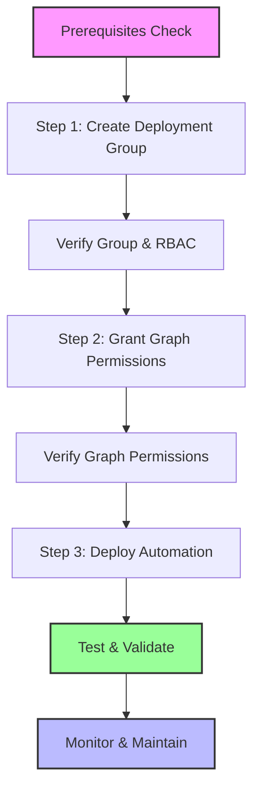

# Azure Automation Deployment Workflow - Standard Operating Procedure

## 🎯 Overview

This document defines the **mandatory 3-step deployment workflow** for all Azure Automation solutions in this repository. This workflow ensures proper security configuration, permission management, and deployment consistency across all automation services.

## ⚠️ Critical Requirements

- **Sequential Execution**: Each step must complete successfully before proceeding to the next
- **Manual Execution**: All steps are run manually by an administrator (no automated deployment)
- **Shared Infrastructure**: Multiple automation services can share the same Automation Account
- **Tenant ID Required**: All scripts now require explicit Tenant ID specification

## 🚀 3-Step Deployment Workflow

### Prerequisites Checklist
Before starting any deployment:
- [ ] Azure Automation Account exists in the target resource group
- [ ] System-assigned managed identity is enabled on the Automation Account
- [ ] User has Global Administrator or Privileged Role Administrator role
- [ ] Tenant ID is available (use `./Scripts/Get-TenantInfo.ps1` to retrieve)
- [ ] Resource group exists and is properly configured
- [ ] PowerShell 7+ is installed with required Azure modules

---

### Step 1: Create Deployment Group 🛡️

**Purpose**: Creates an Azure AD security group and assigns necessary Azure RBAC permissions to the resource group.

```powershell
# Generic template for all services
./[Service-Name]/Azure-Automation/Create-[Service]DeploymentGroup.ps1 `
    -TenantId "your-tenant-id" `
    -ResourceGroupName "rg-automation"
```

**Example for Device Cleanup:**
```powershell
./Device-Cleanup-Automation/Azure-Automation/Create-DeviceCleanupDeploymentGroup.ps1 `
    -TenantId "87db06e7-f38e-4c01-b926-8291bfae4996" `
    -ResourceGroupName "rg-automation"
```

**What this script does:**
- Creates an Azure AD security group (e.g., "Device Cleanup Automation Deployment Group")
- Assigns the group to the specified resource group with required RBAC roles
- Configures proper permissions for Azure Automation Account management
- Validates successful group creation and role assignment

**Expected Output:**
- Azure AD group created successfully
- RBAC permissions assigned to resource group
- Group membership can be managed independently

---

### Step 2: Grant Graph Permissions 🔐

**Purpose**: Assigns required Microsoft Graph API permissions to the Automation Account's managed identity.

```powershell
# Generic template for services with enhanced script
./[Service-Name]/Azure-Automation/Grant-ManagedIdentityPermissions-Enhanced.ps1 `
    -ManagedIdentityObjectId "managed-identity-object-id" `
    -TenantId "your-tenant-id"

# Alternative: Use service-specific grant script
./[Service-Name]/Azure-Automation/Grant-[Service]Permissions.ps1 `
    -AutomationAccountName "aa-automation" `
    -ResourceGroupName "rg-automation" `
    -TenantId "your-tenant-id"
```

**Example for Device Cleanup:**
```powershell
# Using enhanced script (recommended)
./Device-Cleanup-Automation/Azure-Automation/Grant-ManagedIdentityPermissions-Enhanced.ps1 `
    -ManagedIdentityObjectId "12345678-1234-1234-1234-123456789012" `
    -TenantId "87db06e7-f38e-4c01-b926-8291bfae4996"

# Using fixed script (alternative)
./Device-Cleanup-Automation/Scripts/Grant-ManagedIdentityPermissions-Fixed.ps1 `
    -AutomationAccountName "aa-automation" `
    -ResourceGroupName "rg-automation" `
    -TenantId "87db06e7-f38e-4c01-b926-8291bfae4996"
```

**What this script does:**
- Connects to Microsoft Graph with admin permissions
- Locates the managed identity service principal
- Grants specific Microsoft Graph permissions required for the automation
- Validates successful permission assignment
- Provides fallback methods for MSA account issues

**Required Permissions by Service:**

| Service | Graph Permissions |
|---------|------------------|
| **Device Cleanup** | Device.ReadWrite.All, Directory.ReadWrite.All, User.Read.All, Mail.Send |
| **MFA Compliance** | AuditLog.Read.All, User.Read.All, Directory.Read.All, Mail.Send |
| **App Usage Monitor** | Application.Read.All, AuditLog.Read.All, Directory.Read.All, Mail.Send |
| **App Certificate Monitor** | Application.Read.All, Directory.Read.All, Mail.Send |
| **Service Principal Manager** | Application.ReadWrite.All, Directory.Read.All, AuditLog.Read.All, Mail.Send |
| **Application Permission Auditor** | Application.Read.All, DelegatedPermissionGrant.Read.All, AppRoleAssignment.Read.All, Mail.Send |

**Expected Output:**
- Managed identity located successfully
- Required Graph permissions granted
- Admin consent applied
- Permission validation completed

---

### Step 3: Deploy Automation Runbook 📋

**Purpose**: Deploys the actual automation runbook to the existing Automation Account with proper configuration and scheduling.

```powershell
# Generic template for all services
./[Service-Name]/Azure-Automation/Deploy-[Service]Automation.ps1 `
    -AutomationAccountName "aa-automation" `
    -ResourceGroupName "rg-automation" `
    -SubscriptionId "your-subscription-id"
```

**Example for Device Cleanup:**
```powershell
./Device-Cleanup-Automation/Azure-Automation/Deploy-DeviceCleanupAutomation.ps1 `
    -AutomationAccountName "aa-automation" `
    -ResourceGroupName "rg-automation" `
    -SubscriptionId "a7e32e6c-b649-42c9-9387-bbb570d4a2ab"
```

**What this script does:**
- Installs required PowerShell modules in the Automation Account
- Imports the main automation script as a runbook
- Configures automation variables and credentials
- Sets up the execution schedule (e.g., weekly for device cleanup)
- Performs post-deployment validation
- Configures notification settings

**Expected Output:**
- PowerShell modules installed successfully
- Runbook imported and published
- Schedule configured and enabled
- Test execution completed successfully
- Monitoring and alerting configured

---

## 🔍 Validation and Testing

After completing all three steps:

### Immediate Validation
```powershell
# Test Graph connection
./[Service-Name]/Tests/Test-GraphConnection.ps1 -TenantId "your-tenant-id"

# Verify runbook execution
# Go to Azure Portal > Automation Account > Runbooks > [Service]Automation > Test pane
```

### 24-Hour Verification
- Check Azure Automation Account for successful module installation
- Verify first scheduled execution completes without errors
- Confirm email notifications are working properly
- Review Azure Monitor logs for any issues

## 🚨 Troubleshooting Common Issues

### Issue: "API not supported for MSA accounts"
**Solution**: Ensure using organizational account with Tenant ID specified

### Issue: "Managed identity not found"
**Solution**: Verify system-assigned managed identity is enabled on Automation Account

### Issue: "Insufficient permissions"
**Solution**: Confirm user has Global Administrator or Privileged Role Administrator role

### Issue: "Module installation failed"
**Solution**: Check Azure Automation Account module gallery and PowerShell 7.x compatibility

### Issue: "Schedule not created"
**Solution**: Verify Automation Account has proper permissions and modules installed

## 📚 Service-Specific Documentation

Each automation service has detailed documentation in its `/Documentation/CLAUDE.md` file:

- [Device Cleanup Automation](./Device-Cleanup-Automation/Documentation/CLAUDE.md)
- [MFA Compliance Monitor](./MFA-Compliance-Monitor/Documentation/CLAUDE.md)
- [Enterprise App Usage Monitor](./Enterprise-App-Usage-Monitor/Documentation/CLAUDE.md)
- [Enterprise App Certificate Monitor](./Enterprise-App-Certificate-Monitor/Documentation/CLAUDE.md)
- [Service Principal Credential Manager](./Service-Principal-Credential-Manager/Documentation/CLAUDE.md)
- [Application Permission Auditor](./Application-Permission-Auditor/Documentation/CLAUDE.md)

## ✅ Successful Deployment Example

**Real-world deployment completed successfully:**
- **Date**: August 2025
- **Service**: Device Cleanup Automation
- **Automation Account**: `test-device-cleanup-auto`
- **Resource Group**: `test-rg`
- **Result**: ✅ Fully operational with weekly schedule

### Deployment Timeline
1. **Step 1**: Deployment group creation ✅ (Prerequisites met)
2. **Step 2**: Graph permissions granted ✅ (Manual admin approval)
3. **Step 3**: Runbook deployment ✅ (Automated with service principal)

### Key Success Factors
- **Service Principal Authentication**: Used provided credentials for automated deployment
- **Module Installation**: All Microsoft Graph modules installed successfully
- **Runbook Publishing**: Script imported and published without issues
- **Schedule Creation**: Weekly execution configured and linked
- **Test Execution**: WhatIf mode test job started successfully

### Technical Validation
- **Automation Account**: System-assigned managed identity enabled
- **PowerShell Modules**: All Graph modules (v2.15.0) installed
- **Runbook State**: Published and ready for execution
- **Schedule**: Weekly at 2:00 AM UTC, properly linked
- **Permissions**: Graph API permissions validated through managed identity

## 🔄 Workflow Summary



## 📝 Documentation Updates

When creating new automation services, ensure:
- [ ] Create all three deployment scripts following this workflow
- [ ] Update service-specific CLAUDE.md with workflow details
- [ ] Add service to the main deployment matrix
- [ ] Document required Graph permissions
- [ ] Include troubleshooting guidance
- [ ] Test entire workflow before release

---

**Last Updated**: December 2024  
**Applies To**: All Azure Automation services in this repository  
**Next Review**: Quarterly or when Microsoft Graph API changes occur